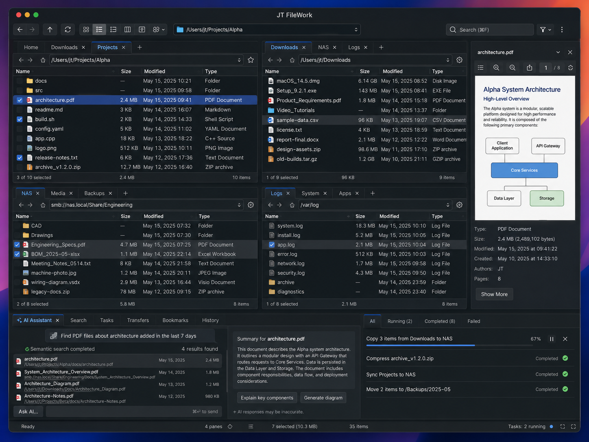
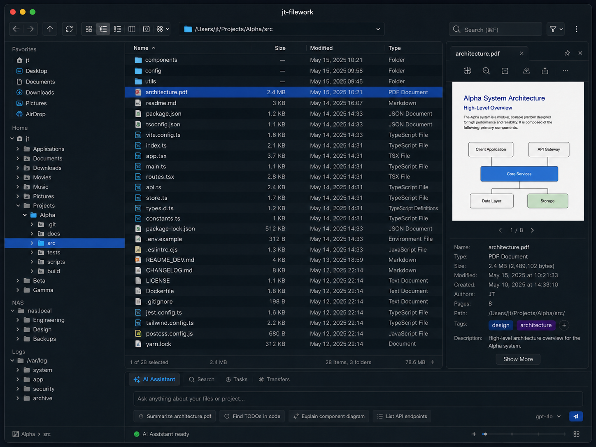

# Reference layout

This mockup is a **reference, not a contract**. The user supplied it as a
direction to head in, explicitly not as something to reproduce pixel for
pixel. Read it as: this is the density, this is the arrangement, these are the
parts that should exist.

Where a detail in the picture conflicts with `docs/UI_CONVENTIONS.md`, the
conventions win — they are the ones written down to be followed. Where the
picture shows something the program does not have yet, that is a candidate for
`docs/FEATURE_INVENTORY.md`, ranked with everything else, not a queue jump.

Judgement still applies. A panel in the picture that turns out to be wrong for
a keyboard-first file manager should not be built merely because it is in the
picture.

## What it gets right, and why we are copying it

It is a good design, and the reasons are worth naming so they survive into
parts of the program the picture does not cover:

- **Density without noise.** Four panes, an inspector and a job list on one
  screen, and it still reads. Achieved with quiet separators and generous row
  height rather than boxes inside boxes.
- **Every pane is self-sufficient.** Tabs, navigation, path and status all sit
  inside the pane. Nothing makes you look at the top of the window to find out
  what a pane at the bottom is showing.
- **One accent colour, spent carefully.** Blue marks the active tab, the
  selected row and the running progress bar — the three things you look for.
  Everything else is greyscale, which is what makes the blue work.
- **Numbers are right-aligned and monospaced.** Sizes and dates form clean
  columns you can scan down, which is the whole reason for the default
  monospace setting.
- **Status lines answer three questions in a fixed order**: what is selected,
  how big it is, how many there are. Same order in every pane, so you learn
  where to look once.
- **Work is visible without being modal.** Jobs run in a corner with progress,
  pause and cancel, instead of a dialog across the middle of the screen.

These are the qualities to preserve. The exact pixel arrangement is not.

One correction to the first image: its title bar reads with capitals and a
space. The product name is `jt-filework`, lowercase and hyphenated, in the
title bar and everywhere else — `AGENTS.md` §10.1, enforced by
`tests/tests/architecture.rs::product_name_has_one_spelling`. The second image
gets this right.

## The single-pane view

The same program with one pane, and it fills in what the four-pane picture
could not show:

- **The sidebar is sections of trees, not one tree.** `Favorites` is a flat
  list; `Home`, `NAS` and `Logs` are each a named root you expand into. So a
  bookmark is not only a shortcut — it can be a root the tree grows from.
- **The status line counts folders**: `28 items, 3 folders`, with the total
  size of what is listed at the right. Four facts, and the folder count is the
  one that tells you what kind of directory you are in.
- **The sort indicator is a caret beside the header text**, not a separate
  column decoration.
- **The inspector is a tabbed panel** with a pin, a row of actions, page
  navigation for paged formats, and rows that go beyond the filesystem: Tags
  with an add button, and a Description.
- **A breadcrumb sits in the window status bar**, bottom left, rather than
  above the list — which is how the layout affords four panes without four
  breadcrumb rows.
- **A zoom slider** sits at the bottom right, next to a view-mode control.

## What the picture commits us to

### 1. Window chrome

A single toolbar row: back, forward, up, refresh · view-mode group (icons,
list, detail, columns) · preview toggle · split-layout menu · path field ·
search field · filter menu · overflow menu. Navigation on the left, search on
the right, view controls between them.

### 2. Panes

Four panes in a 2×2 grid, each complete in itself: its own tab strip with a
`+`, its own back/forward/up/home row, its own path field, its own bookmark
star and settings gear, its own column header, its own status line.

A pane is a whole file manager. Nothing in a pane reaches outside it. This is
the recursive split tree of `AGENTS.md` §7 drawn out: there is no "left pane"
and no "right pane", only panes.

### 3. The list

Leading checkbox, file-type icon, then `Name · Size · Modified · Type`. The
sort indicator sits in the sorted column's header. The checkbox is the mark
set — the same one the keyboard's space bar drives, not a second concept.

### 4. Per-pane status line

`3 of 10 selected` on the left, the size of the selection in the middle, the
item count on the right. Three facts, three anchors, no wrapping.

### 5. Inspector

A right-hand panel: a preview of the focused file, then Type, Size, Modified,
Created, and format-specific rows (Authors and Pages for a PDF), then
`Show More`. Its own header with a close control, so it can go away.

### 6. Bottom dock

Tabs across the bottom left — AI Assistant, Search, Tasks, Transfers,
Bookmarks, History — and a job list on the bottom right with per-job progress,
pause and cancel, filtered by All / Running / Completed / Failed.

### 7. Window status bar

The workspace as a whole: readiness, pane count, total selection with its
size, total item count, running task count.

## State

| Area | Status |
| --- | --- |
| Toolbar: navigation, refresh, tree toggle, overflow | Done |
| Toolbar: view-mode group, split-layout menu | Planned |
| Per-pane tabs, path, status line | Done |
| Breadcrumb path with clickable segments | Done |
| Per-pane bookmark star and gear | Planned |
| List columns `Name · Size · Modified · Type` | Done |
| Status line: folder count and listed size | Done |
| Sidebar: bookmarks, volumes, recent | Done |
| Sidebar: named tree roots per section | Planned |
| Checkbox marks in the list | Done |
| Sort indicator | Done |
| Window status bar aggregate | Done |
| Inspector panel | Done — preview and facts; no tags, tabs or paging |
| Inspector: tags, description, page navigation | Planned |
| Zoom slider | Planned |
| Bottom dock: Tasks, Transfers, Bookmarks, History | Planned |
| Bottom dock: AI Assistant | Deferred — `docs/SEARCH_AI.md` |

The AI panel is deferred deliberately. It is the largest thing in the picture
and the least load-bearing for a file manager; the fundamentals come first.
